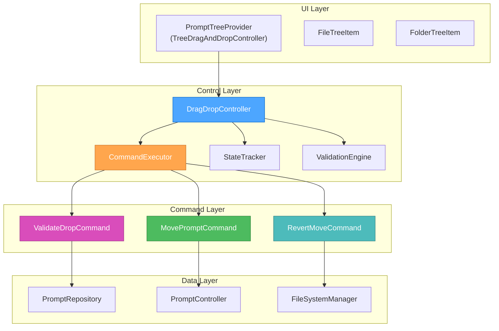

# Creative Phase: Drag and Drop Architecture Design

🎨🎨🎨 **ENTERING CREATIVE PHASE: ARCHITECTURE DESIGN** 🎨🎨🎨

**Date**: 2025-01-18  
**Component**: Drag and Drop Controller and State Management Architecture  
**Phase Type**: Architecture Design  
**Status**: In Progress

## 📋 PROBLEM STATEMENT

**Challenge**: Design a robust, maintainable architecture for drag-and-drop functionality that integrates seamlessly with the existing VSCode extension architecture while providing reliable file move operations and state management.

**Key Architecture Questions**:

- How should the drag-and-drop controller integrate with the existing PromptTreeProvider?
- What is the optimal state management approach for drag operations?
- How should file move operations be orchestrated across the data layer?
- What error handling and validation patterns should be implemented?
- How can we ensure the architecture is testable and maintainable?

**System Requirements**:

- Integrate with VSCode TreeDragAndDropController API
- Maintain existing dependency injection patterns
- Provide atomic file move operations with rollback capability
- Handle concurrent operations gracefully
- Support extensibility for future drag-and-drop enhancements

## 🏗️ ARCHITECTURE CONSTRAINTS & CONTEXT

**Existing Architecture**:

- **Repository Pattern**: PromptRepository handles data operations
- **Controller Pattern**: PromptController orchestrates UI interactions
- **Dependency Injection**: TSyringe-based DI container
- **Event Bus**: Centralized event system for component communication
- **File System Layer**: FileSystemManager handles low-level file operations

**Technical Constraints**:

- Must implement VSCode's TreeDragAndDropController interface
- Cannot break existing tree provider functionality
- Must maintain transaction-like semantics for file operations
- Need to preserve event-driven architecture patterns
- Must support undo/redo operations

## 🔍 ARCHITECTURE OPTIONS ANALYSIS

### Option 1: Controller Extension Pattern

**Description**: Extend PromptTreeProvider with drag-and-drop methods, minimal new components

**Architecture**:

```
PromptTreeProvider (extends TreeDragAndDropController)
├── handleDrag()
├── handleDrop()
└── existing tree methods...
```

**Pros**:

- Minimal architectural changes
- All tree logic in one place
- Simple implementation path
- Lower complexity

**Cons**:

- Violates single responsibility principle
- Makes PromptTreeProvider harder to test
- Difficult to extend with advanced features
- Couples drag-and-drop tightly to tree rendering

**Scalability**: Low  
**Maintainability**: Low  
**Testability**: Low  
**Implementation Time**: 2-3 days

### Option 2: Dedicated Drag-and-Drop Service

**Description**: Create separate DragDropService with full state management and operation orchestration

**Architecture**:

```
DragDropService
├── DragDropStateManager
├── OperationValidator
├── FileOperationOrchestrator
└── ConflictResolver

PromptTreeProvider
├── implements TreeDragAndDropController
└── delegates to DragDropService
```

**Pros**:

- Clear separation of concerns
- Highly testable individual components
- Easy to extend with new features
- Clean dependency graph
- Supports complex operations (batch, undo/redo)

**Cons**:

- Higher initial complexity
- More files to maintain
- Potential over-engineering for simple use case
- Longer implementation time

**Scalability**: High  
**Maintainability**: High  
**Testability**: High  
**Implementation Time**: 5-7 days

### Option 3: Hybrid Command Pattern Architecture

**Description**: Lightweight service with command pattern for operations, balanced complexity

**Architecture**:

```
DragDropController
├── CommandExecutor
├── StateTracker
└── ValidationEngine

Commands:
├── MovePromptCommand
├── ValidateDropCommand
└── RevertMoveCommand

PromptTreeProvider (implements TreeDragAndDropController)
└── delegates to DragDropController
```

**Pros**:

- Balanced complexity and functionality
- Command pattern enables undo/redo naturally
- Clear operation boundaries
- Good testability
- Follows existing patterns in codebase

**Cons**:

- Moderate complexity increase
- Command pattern may be overkill for simple moves
- Need to design command interface carefully

**Scalability**: Medium-High  
**Maintainability**: High  
**Testability**: High  
**Implementation Time**: 3-5 days

## 🎯 ARCHITECTURE DECISION

**Selected Option**: **Option 3: Hybrid Command Pattern Architecture**

**Rationale**:

1. **Balanced Complexity**: Provides necessary functionality without over-engineering
2. **Command Pattern Benefits**: Natural fit for undo/redo and transaction-like operations
3. **Testability**: Clear boundaries between components enable focused testing
4. **Existing Patterns**: Aligns with dependency injection and controller patterns already in use
5. **Extensibility**: Can easily add new drag-and-drop commands without architectural changes
6. **Maintainability**: Separates concerns while keeping the design comprehensible

## 📐 DETAILED ARCHITECTURE SPECIFICATIONS

### 1. Component Architecture



### 2. Core Components Design

#### DragDropController

```typescript
@injectable()
export class DragDropController {
  constructor(
    @inject(DI_TOKENS.CommandExecutor) private commandExecutor: CommandExecutor,
    @inject(DI_TOKENS.StateTracker) private stateTracker: StateTracker,
    @inject(DI_TOKENS.ValidationEngine)
    private validationEngine: ValidationEngine,
    @inject(DI_TOKENS.PromptController)
    private promptController: PromptController
  ) {}

  async handleDrag(item: PromptTreeItem): Promise<DragData> {
    // Validate drag source
    // Create drag data object
    // Update state tracker
  }

  async handleDrop(
    dragData: DragData,
    dropTarget: PromptTreeItem
  ): Promise<DropResult> {
    // Validate drop operation
    // Execute move command
    // Handle results and errors
  }

  async validateDrop(
    dragData: DragData,
    dropTarget: PromptTreeItem
  ): Promise<ValidationResult> {
    // Delegate to validation engine
  }
}
```

#### Command Interface

```typescript
interface DragDropCommand {
  execute(): Promise<CommandResult>;
  undo(): Promise<CommandResult>;
  canExecute(): boolean;
  getDescription(): string;
}

interface CommandResult {
  success: boolean;
  data?: any;
  error?: Error;
  undoData?: any;
}
```

#### MovePromptCommand

```typescript
@injectable()
export class MovePromptCommand implements DragDropCommand {
  constructor(
    private sourceFile: PromptFile,
    private targetFolder: PromptFolder | null, // null = root
    private promptController: PromptController
  ) {}

  async execute(): Promise<CommandResult> {
    // 1. Validate move operation
    // 2. Create backup information for undo
    // 3. Execute file move via PromptController
    // 4. Update tree state
    // 5. Return result with undo data
  }

  async undo(): Promise<CommandResult> {
    // Restore file to original location using undo data
  }

  canExecute(): boolean {
    // Check if move is valid (different location, permissions, etc.)
  }
}
```

### 3. State Management Design

#### DragDropState

```typescript
interface DragDropState {
  activeDrag: {
    item: PromptFile;
    startTime: number;
    originalLocation: {
      folder: PromptFolder | null;
      index: number;
    };
  } | null;

  dropTarget: {
    target: PromptFolder | null;
    validation: "valid" | "invalid" | "pending";
    hoverStartTime: number;
  } | null;

  operation: {
    command: DragDropCommand;
    status: "pending" | "executing" | "completed" | "failed";
    progress?: number;
  } | null;

  history: DragDropOperation[];
}
```

#### StateTracker

```typescript
@injectable()
export class StateTracker {
  private state: DragDropState = {
    activeDrag: null,
    dropTarget: null,
    operation: null,
    history: [],
  };

  startDrag(item: PromptFile): void {
    /* Update state */
  }
  updateDropTarget(
    target: PromptFolder | null,
    validation: ValidationResult
  ): void {
    /* Update state */
  }
  startOperation(command: DragDropCommand): void {
    /* Update state */
  }
  completeOperation(result: CommandResult): void {
    /* Update state, add to history */
  }
  clearState(): void {
    /* Reset state */
  }

  getState(): Readonly<DragDropState> {
    return this.state;
  }
}
```

### 4. Integration with Existing Architecture

#### PromptTreeProvider Integration

```typescript
export class PromptTreeProvider
  implements
    TreeDataProvider<PromptTreeItem>,
    TreeDragAndDropController<PromptTreeItem>
{
  constructor(
    // ... existing dependencies
    @inject(DI_TOKENS.DragDropController)
    private dragDropController: DragDropController
  ) {
    // ... existing initialization
  }

  // TreeDragAndDropController implementation
  dropMimeTypes = ["application/vnd.code.tree.promptmanagertree"];
  dragMimeTypes = ["application/vnd.code.tree.promptmanagertree"];

  async handleDrag(
    source: readonly PromptTreeItem[],
    dataTransfer: DataTransfer,
    token: CancellationToken
  ): Promise<void> {
    // Delegate to DragDropController
    const dragData = await this.dragDropController.handleDrag(source[0]);
    dataTransfer.set(this.dragMimeTypes[0], JSON.stringify(dragData));
  }

  async handleDrop(
    target: PromptTreeItem | undefined,
    dataTransfer: DataTransfer,
    token: CancellationToken
  ): Promise<void> {
    // Extract drag data and delegate to DragDropController
    const dragDataStr = dataTransfer.get(this.dragMimeTypes[0]);
    const dragData = JSON.parse(dragDataStr);
    const result = await this.dragDropController.handleDrop(dragData, target);

    if (result.success) {
      this.refresh(); // Refresh tree view
    }
  }
}
```

### 5. Error Handling and Validation

#### ValidationEngine

```typescript
@injectable()
export class ValidationEngine {
  async validateMoveOperation(
    source: PromptFile,
    target: PromptFolder | null
  ): Promise<ValidationResult> {
    const checks: ValidationCheck[] = [
      new SourceExistsCheck(source),
      new TargetExistsCheck(target),
      new PermissionsCheck(source, target),
      new SameLocationCheck(source, target),
      new FileConflictCheck(source, target),
    ];

    for (const check of checks) {
      const result = await check.validate();
      if (!result.valid) {
        return result;
      }
    }

    return { valid: true };
  }
}

interface ValidationResult {
  valid: boolean;
  error?: string;
  warning?: string;
  canProceed?: boolean;
}
```

### 6. Event Integration

#### Event Flow

```typescript
// Events published during drag-and-drop operations
enum DragDropEvents {
  DRAG_STARTED = "dragdrop.drag.started",
  DROP_TARGET_CHANGED = "dragdrop.target.changed",
  VALIDATION_COMPLETED = "dragdrop.validation.completed",
  OPERATION_STARTED = "dragdrop.operation.started",
  OPERATION_COMPLETED = "dragdrop.operation.completed",
  OPERATION_FAILED = "dragdrop.operation.failed",
}

// Integration with existing event bus
eventBus.emit(DragDropEvents.OPERATION_COMPLETED, {
  sourceFile: result.sourceFile,
  targetFolder: result.targetFolder,
  duration: result.duration,
});
```

## 📊 DEPENDENCY INJECTION SETUP

```typescript
// DI Token definitions
export const DI_TOKENS = {
  // ... existing tokens
  DragDropController: Symbol("DragDropController"),
  CommandExecutor: Symbol("CommandExecutor"),
  StateTracker: Symbol("StateTracker"),
  ValidationEngine: Symbol("ValidationEngine"),
  MovePromptCommandFactory: Symbol("MovePromptCommandFactory"),
};

// Container registration
container.registerSingleton(DI_TOKENS.DragDropController, DragDropController);
container.registerSingleton(DI_TOKENS.CommandExecutor, CommandExecutor);
container.registerSingleton(DI_TOKENS.StateTracker, StateTracker);
container.registerSingleton(DI_TOKENS.ValidationEngine, ValidationEngine);
container.registerFactory(DI_TOKENS.MovePromptCommandFactory, (container) => {
  return (source: PromptFile, target: PromptFolder | null) =>
    new MovePromptCommand(
      source,
      target,
      container.resolve(DI_TOKENS.PromptController)
    );
});
```

## ✅ ARCHITECTURE VALIDATION

### Requirements Coverage

- [x] **VSCode Integration**: TreeDragAndDropController properly implemented
- [x] **Existing Patterns**: Maintains DI, repository, and controller patterns
- [x] **Atomic Operations**: Command pattern enables transaction-like semantics
- [x] **Error Handling**: Comprehensive validation and error recovery
- [x] **Testability**: Clear component boundaries enable focused testing
- [x] **Extensibility**: Command pattern allows easy addition of new operations
- [x] **State Management**: Centralized state tracking for complex scenarios

### Technical Feasibility

- [x] **API Compatibility**: Uses standard VSCode TreeDragAndDropController interface
- [x] **Performance**: Minimal overhead, async operations don't block UI
- [x] **Memory Usage**: Stateful but bounded (limited history, cleanup on complete)
- [x] **Concurrency**: Single active operation prevents race conditions

### Risk Assessment

- **Low Risk**: Well-defined interfaces, proven patterns
- **Medium Risk**: VSCode API changes (mitigated by abstraction layer)
- **Low Risk**: Performance impact (minimal state, efficient operations)

## 🚀 IMPLEMENTATION PHASES

### Phase 1: Core Infrastructure

1. Create DragDropController and basic interfaces
2. Implement StateTracker with basic state management
3. Set up DI container registrations

### Phase 2: Command Implementation

1. Implement MovePromptCommand with execute/undo
2. Create CommandExecutor with basic execution logic
3. Add ValidationEngine with essential validations

### Phase 3: TreeProvider Integration

1. Implement TreeDragAndDropController in PromptTreeProvider
2. Wire up drag/drop handlers to DragDropController
3. Add basic error handling and user feedback

### Phase 4: Advanced Features

1. Add comprehensive validation rules
2. Implement operation history and undo support
3. Add progress indicators and conflict resolution

## 📁 FILE STRUCTURE

```
src/features/prompt-manager/
├── domain/
│   ├── dragdrop/
│   │   ├── DragDropController.ts
│   │   ├── StateTracker.ts
│   │   ├── ValidationEngine.ts
│   │   ├── commands/
│   │   │   ├── DragDropCommand.ts (interface)
│   │   │   ├── MovePromptCommand.ts
│   │   │   ├── ValidateDropCommand.ts
│   │   │   └── RevertMoveCommand.ts
│   │   └── validators/
│   │       ├── ValidationCheck.ts (interface)
│   │       ├── SourceExistsCheck.ts
│   │       ├── PermissionsCheck.ts
│   │       └── FileConflictCheck.ts
│   ├── promptController.ts (existing - minor additions)
│   └── promptRepository.ts (existing - file move methods)
├── ui/tree/
│   ├── PromptTreeProvider.ts (existing - TreeDragAndDropController implementation)
│   └── items/ (existing - drag/drop state additions)
└── data/
    └── fileManager.ts (existing - file move operations)
```

🎨🎨🎨 **EXITING CREATIVE PHASE - ARCHITECTURE DECISION MADE** 🎨🎨🎨

**Result**: Hybrid Command Pattern Architecture selected for optimal balance of functionality, maintainability, and integration with existing systems.
