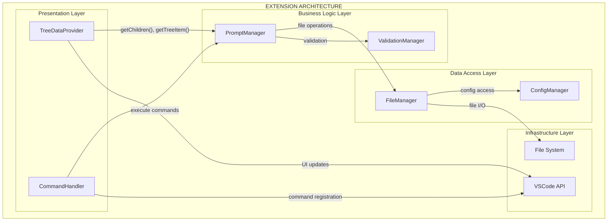
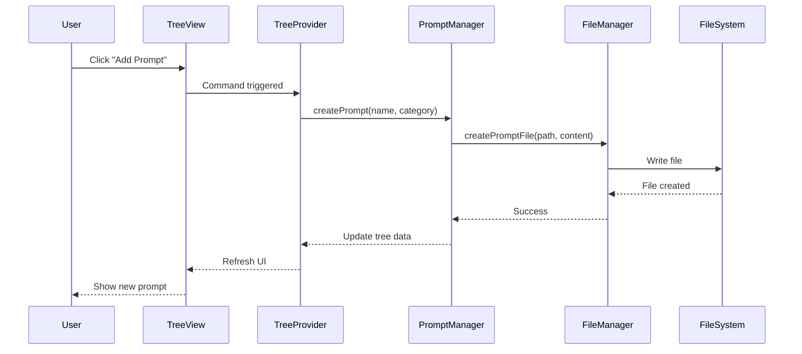
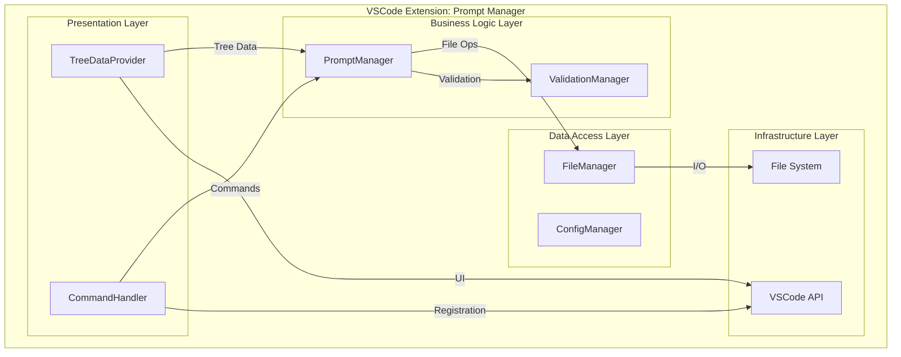

# 🎨 CREATIVE PHASE DOCUMENT: VSCode Prompt Manager Extension

**Document Purpose**: Comprehensive design document capturing all creative phase decisions for the VSCode Prompt Manager extension development.

**Project**: VSCode Extension to manage prompts for LLMs  
**Complexity Level**: Level 3 (Intermediate Feature)  
**Creative Phases Required**: UI/UX Design, Architecture Design, Data Management Design  
**Created**: 2024-01-15  
**Status**: Complete - Ready for Implementation

---

## 🎨🎨🎨 ENTERING CREATIVE PHASE: COMPREHENSIVE DESIGN 🎨🎨🎨

**Focus**: Complete design solution for VSCode extension with tree view, file management, and prompt organization  
**Objective**: Create detailed design specifications for all major components and user interactions  
**Requirements**:

- Custom extension UI with tree view
- Local storage in `.prompt_manager` directory
- Prompt organization and management
- Editor integration for opening files
- Add new prompt functionality

---

## 📋 CREATIVE PHASE 1: UI/UX DESIGN

### Problem Statement

Design an intuitive and efficient user interface that integrates seamlessly with VSCode for managing LLM prompts. The interface must feel native to VSCode while providing specialized prompt management capabilities.

### User Analysis

**Target Users**: Developers and AI practitioners working with LLMs  
**Primary Goals**:

- Quickly access and organize prompts within development workflow
- Seamlessly add new prompts without disrupting coding flow
- Easily browse and open existing prompts for editing/reference
- Maintain organized prompt libraries for different projects

**User Stories**:

1. **As a developer**, I want to see all my prompts in a tree structure so I can quickly find what I need
2. **As a prompt engineer**, I want to add new prompts with a simple button click so I can capture ideas immediately
3. **As a team member**, I want prompts stored in my project directory so they're version-controlled with my code
4. **As a user**, I want to click on prompts to open them in the editor so I can view/edit content easily

### UI/UX Options Analysis

#### Option 1: VSCode TreeView Panel ⭐ **SELECTED**

**Description**: Native VSCode TreeView integrated into Explorer panel area with custom TreeDataProvider

**Pros**:

- Native VSCode look and feel - users already familiar with interaction patterns
- Built-in context menu support, keyboard navigation, drag/drop capabilities
- Automatic theming (follows user's VSCode theme)
- Efficient performance with lazy loading
- Access to VSCode's icon library and styling
- Integration with VSCode workspace settings

**Cons**:

- Limited customization compared to webview panels
- Constrained to TreeView interaction patterns
- Cannot include complex form inputs directly in tree

**Technical Fit**: High (using standard VSCode Extension API)  
**Complexity**: Medium (requires TreeDataProvider implementation)  
**Implementation Time**: 2-3 days

### UI/UX Design Decision

**Selected: Option 1 - VSCode TreeView Panel**

**Rationale**:

1. **User Familiarity**: Users already understand how to interact with tree views in VSCode
2. **Performance**: Native TreeView provides the best performance for large prompt collections
3. **Consistency**: Follows VSCode design patterns users expect from extensions
4. **Maintainability**: Uses stable, well-documented VSCode APIs
5. **Accessibility**: Inherits VSCode's accessibility features automatically

### UI Layout Specification

```
┌─────────────────────────────────┐
│ 📋 PROMPT MANAGER         🔄 ➕ │ ← Header with refresh/add actions
├─────────────────────────────────┤
│ 📁 .prompt_manager              │
│ ├── 📁 coding                   │ ← Folders for organization
│ │   ├── 📄 code-review.md       │ ← Individual prompt files
│ │   └── 📄 debugging.md         │
│ ├── 📁 writing                  │
│ │   └── 📄 blog-post.md         │
│ ├── 📄 system-prompt.md         │ ← Root-level prompts
│ └── 📄 quick-fix.md             │
│                                 │
│ [Empty state: "No prompts yet"] │ ← When no prompts exist
│ [Click + to add your first one] │
└─────────────────────────────────┘
```

### Interaction Patterns

- **Single Click**: Open prompt file in VSCode editor
- **Right Click**: Context menu (Delete)
- **Header + Button**: Create new prompt (opens input dialog)
- **Header Refresh Button**: Re-scan `.prompt_manager` directory

### Visual Design Guidelines

- **Icons**: Use VSCode's built-in Codicons (file, folder, plus, refresh)
- **Typography**: VSCode's default UI font and sizing
- **Colors**: Inherit from VSCode theme (no custom colors needed)
- **Spacing**: Follow VSCode's tree view spacing conventions

---

## 🏗️ CREATIVE PHASE 2: ARCHITECTURE DESIGN

### Problem Statement

Design a modular, maintainable extension architecture that efficiently handles file operations, UI state management, and VSCode integration while supporting future feature additions.

### System Requirements

- Implement TreeDataProvider interface for prompt visualization
- Handle file system operations for `.prompt_manager` directory
- Manage extension lifecycle (activation, deactivation, cleanup)
- Provide command registration for user actions
- Handle workspace changes and file watching
- Maintain UI state synchronization with file system

### Architecture Options Analysis

#### Option 1: Layered Architecture ⭐ **SELECTED**

**Description**: Traditional layered approach with clear separation of concerns

```
┌─────────────────────────────────────┐
│         Presentation Layer          │ ← TreeDataProvider, Commands
├─────────────────────────────────────┤
│         Business Logic Layer        │ ← PromptManager, validation
├─────────────────────────────────────┤
│         Data Access Layer           │ ← FileManager, file operations
├─────────────────────────────────────┤
│         Infrastructure Layer        │ ← VSCode API, file system
└─────────────────────────────────────┘
```

**Pros**:

- Clear separation of concerns and responsibilities
- Easy to test individual layers in isolation
- Well-understood architectural pattern
- Scales well as features are added
- Clear data flow between layers

**Cons**:

- Can introduce unnecessary abstraction for simple operations
- Potential performance overhead with multiple layer calls

**Technical Fit**: High  
**Complexity**: Medium  
**Scalability**: High

### Architecture Design Decision

**Selected: Option 1 - Layered Architecture**

**Rationale**:

1. **Maintainability**: Clear layer separation makes the codebase easy to understand and maintain
2. **Testability**: Each layer can be tested independently with proper mocking
3. **Scalability**: Architecture supports future features without major refactoring
4. **VSCode Patterns**: Aligns with how many successful VSCode extensions are structured

### Component Architecture



### Component Specifications

#### Extension Entry Point (`extension.ts`)

**Responsibilities**:

- Extension activation/deactivation lifecycle
- Register TreeDataProvider with VSCode
- Register all commands with VSCode
- Initialize and wire up all components

#### TreeDataProvider (`promptTreeProvider.ts`)

**Responsibilities**:

- Implement VSCode TreeDataProvider interface
- Provide tree structure data to VSCode TreeView
- Handle tree refresh and updates
- Manage tree item icons, labels, and states

#### PromptManager (`promptManager.ts`)

**Responsibilities**:

- Core business logic for prompt operations
- Coordinate between UI and data layers
- Handle prompt creation, deletion, organization
- Manage prompt metadata and validation

#### FileManager (`fileManager.ts`)

**Responsibilities**:

- Abstract file system operations
- Handle `.prompt_manager` directory management
- Provide file watching capabilities
- Ensure safe file operations within workspace

#### CommandHandler (`commandHandler.ts`)

**Responsibilities**:

- Handle all VSCode command registrations
- Process user actions (add prompt, delete, etc.)
- Coordinate UI interactions with business logic

---

## ⚙️ CREATIVE PHASE 3: DATA MANAGEMENT DESIGN

### Problem Statement

Design efficient data structures and file organization that scales well, provides good user experience, and maintains compatibility with version control and external editing tools.

### Data Requirements

- Store prompt content with metadata (name, category, dates)
- Organize prompts in hierarchical folder structure
- Support efficient scanning and indexing for tree view
- Enable search and filtering capabilities
- Maintain file system compatibility and version control friendliness

### Data Management Options Analysis

#### Option 1: Simple File-Based Structure ⭐ **SELECTED**

**Description**: Direct file storage with minimal metadata, rely on file system for organization

```
.prompt_manager/
├── coding/
│   ├── code-review.md
│   ├── debugging.md
│   └── refactoring.md
├── writing/
│   ├── blog-post.md
│   └── documentation.md
├── system-prompt.md
└── quick-fixes.md
```

**Metadata Approach**: Use front matter in markdown files

```markdown
---
title: "Code Review Helper"
category: "coding"
created: "2024-01-15"
modified: "2024-01-20"
tags: ["review", "quality", "feedback"]
---

# Code Review Prompt

Please review this code and provide feedback on...
```

**Pros**:

- Simple and intuitive file organization
- Human-readable and editable outside VSCode
- Version control friendly (each file tracked separately)
- No complex indexing or database requirements
- Cross-platform compatible
- Easy backup and sharing

**Cons**:

- Scanning large directories could be slow
- No built-in search indexing
- Metadata parsing required for each file

**Technical Fit**: High  
**Complexity**: Low  
**Implementation Time**: 2-3 days

### Data Management Design Decision

**Selected: Option 1 - Simple File-Based Structure**

**Rationale**:

1. **Simplicity**: Easiest to understand, implement, and maintain
2. **User Control**: Users can manually organize folders as they prefer
3. **Transparency**: File structure is completely visible and editable
4. **Version Control**: Each prompt file can be tracked independently
5. **Portability**: Works across any system, easy to backup/share

### Data Structure Specifications

#### Directory Structure Convention

```
.prompt_manager/
├── README.md                    ← Auto-generated usage guide
├── templates/                   ← Built-in prompt templates
│   ├── code-review.md
│   └── debugging.md
├── [user-folders]/             ← User-created categories
│   ├── coding/
│   ├── writing/
│   ├── analysis/
│   └── personal/
└── [root-prompts]/             ← Uncategorized prompts
    ├── system-prompt.md
    └── quick-fixes.md
```

#### File Naming Conventions

**Rules**:

- Use kebab-case for file names: `code-review-template.md`
- Avoid special characters: `/ \ : * ? " < > |`
- Maximum 50 characters for cross-platform compatibility
- Always use `.md` extension for markdown formatting
- Folder names follow same rules

#### Metadata Schema (Front Matter)

**Standard Front Matter**:

```yaml
---
title: "Human Readable Title" # Required
description: "Brief description" # Optional
tags: ["tag1", "tag2", "tag3"] # Optional
created: "2024-01-15T10:00:00Z" # Auto-generated
modified: "2024-01-20T15:30:00Z" # Auto-updated
author: "username" # Optional
version: "1.0" # Optional
---
```

#### File Content Template

```markdown
---
title: "Code Review Helper"
description: "Assists with comprehensive code review"
tags: ["review", "quality", "feedback"]
created: "2024-01-15T10:00:00Z"
modified: "2024-01-15T10:00:00Z"
---

# Code Review Helper

## Purpose

This prompt helps generate thorough and constructive code review feedback.

## Instructions

Please review the following code and provide:

1. **Functionality**: Does the code work as intended?
2. **Readability**: Is the code clear and well-documented?
3. **Performance**: Are there any performance concerns?
4. **Security**: Are there any security vulnerabilities?

## Example Usage
```

[Paste code here for review]

```

## Template Response Format
- **Overall Assessment**: [Summary]
- **Strengths**: [What works well]
- **Areas for Improvement**: [Specific suggestions]
- **Priority**: [High/Medium/Low]
```

#### Scanning and Indexing Strategy

**Data Structures**:

```typescript
interface PromptStructure {
  folders: PromptFolder[];
  rootPrompts: PromptFile[];
}

interface PromptFolder {
  name: string;
  path: string;
  prompts: PromptFile[];
}

interface PromptFile {
  name: string;
  title: string;
  path: string;
  description?: string;
  tags: string[];
  created: Date;
  modified: Date;
  fileSize: number;
}
```

**Performance Optimizations**:

- Cache scan results in memory
- Use file system watchers to detect changes
- Debounce rapid file changes (500ms)
- Only re-parse files that have changed
- Sort folders alphabetically, files by modified date (newest first)

---

## 🎨 CREATIVE CHECKPOINT: COMPREHENSIVE DESIGN VERIFICATION

### Design Decision Summary

| Phase                   | Selected Option       | Key Benefits                                 | Implementation Complexity |
| ----------------------- | --------------------- | -------------------------------------------- | ------------------------- |
| **UI/UX Design**        | VSCode TreeView Panel | Native integration, familiar UX, performance | Medium                    |
| **Architecture Design** | Layered Architecture  | Maintainability, testability, scalability    | Medium                    |
| **Data Management**     | File-Based Structure  | Simplicity, transparency, version control    | Low                       |

### Requirements Verification

✅ **R1**: Create extension-specific UI panel/tab  
→ **Solution**: VSCode TreeView Panel integrated into Explorer area

✅ **R2**: Implement tree view for prompt organization  
→ **Solution**: Custom TreeDataProvider with folder/file hierarchy

✅ **R3**: File system management for `.prompt_manager` directory  
→ **Solution**: FileManager component with safe workspace operations

✅ **R4**: Open files in VSCode editor on click  
→ **Solution**: Command handler with `vscode.open()` integration

✅ **R5**: Add new prompt functionality with UI button  
→ **Solution**: Header button + input dialog workflow

✅ **R6**: Persistent storage and retrieval of prompts  
→ **Solution**: File-based storage with front matter metadata

### Technical Constraints Verification

✅ **C1**: Must work within VSCode extension sandbox  
→ **Solution**: Uses only standard VSCode Extension APIs

✅ **C2**: File operations limited to workspace scope  
→ **Solution**: FileManager enforces workspace boundaries

✅ **C3**: UI must follow VSCode design patterns  
→ **Solution**: Native TreeView with VSCode theming and icons

✅ **C4**: Performance considerations for large prompt collections  
→ **Solution**: Caching, file watching, and lazy loading strategies

### Implementation Readiness Checklist

✅ **All Requirements Addressed**: Every requirement has a specific solution  
✅ **Multiple Options Explored**: 3 options analyzed for each creative phase  
✅ **Decisions Justified**: Clear rationale provided for each selection  
✅ **Technical Feasibility**: All solutions use standard VSCode APIs  
✅ **Performance Considered**: Optimization strategies defined  
✅ **Error Handling Planned**: Error handling patterns established  
✅ **User Experience Optimized**: Native VSCode patterns ensure familiarity  
✅ **Maintainability Ensured**: Layered architecture supports future development

---

## 🎨🎨🎨 EXITING CREATIVE PHASE - DESIGN COMPLETE 🎨🎨🎨

### Summary of Key Design Decisions

**UI/UX Architecture**: VSCode TreeView Panel for native integration and optimal user experience  
**System Architecture**: Layered design with clear separation of concerns (Presentation → Business Logic → Data Access → Infrastructure)  
**Data Management**: Simple file-based structure with YAML front matter metadata for transparency and version control compatibility

### Implementation Guidelines

1. **Start with Extension Entry Point**: Set up basic extension structure and command registration
2. **Implement FileManager**: Create core file operations and directory management
3. **Build PromptManager**: Add business logic for prompt operations and validation
4. **Create TreeDataProvider**: Implement VSCode TreeView interface and data binding
5. **Add CommandHandler**: Wire up user actions and UI interactions
6. **Implement Metadata Parsing**: Add front matter parsing and file scanning
7. **Add Performance Optimizations**: Implement caching and file watching
8. **Test and Polish**: Comprehensive testing and error handling

### Next Phase Requirements

**Technology Validation Needed**:

- [ ] VSCode Extension API exploration completed
- [ ] TreeView implementation proof of concept
- [ ] File system operations validated
- [ ] Test build passes successfully

**Ready for**: IMPLEMENT MODE - All design decisions documented and verified

### Architecture Diagrams

**Data Flow**:



**Component Architecture**:



This comprehensive design document provides all necessary specifications for implementing the VSCode Prompt Manager extension. The design prioritizes simplicity, maintainability, and native VSCode integration while ensuring scalability for future enhancements.

**Status**: ✅ **CREATIVE PHASES COMPLETE** - Ready for Implementation
