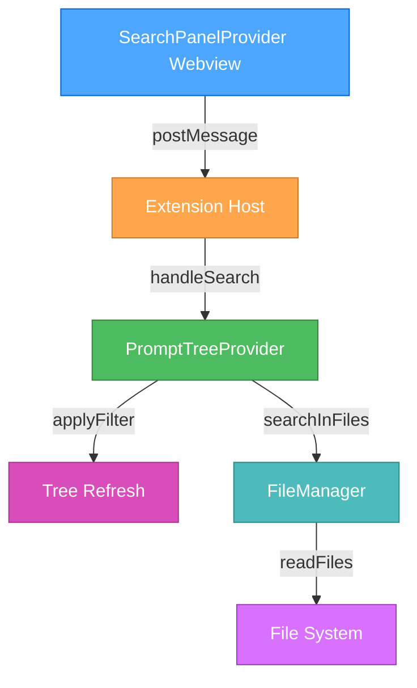
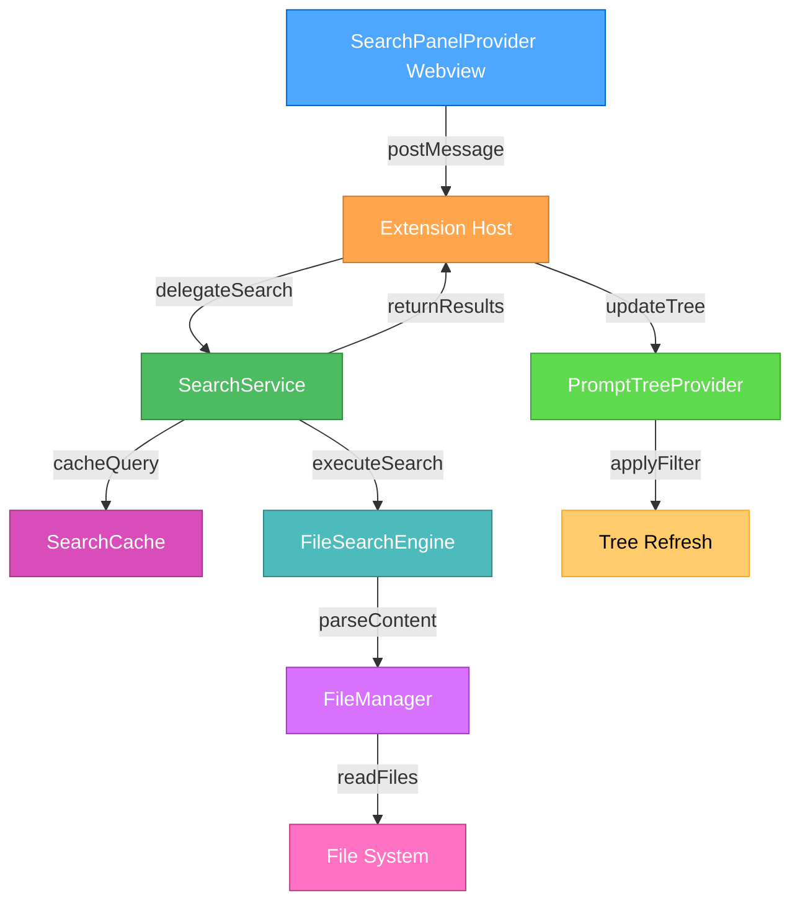
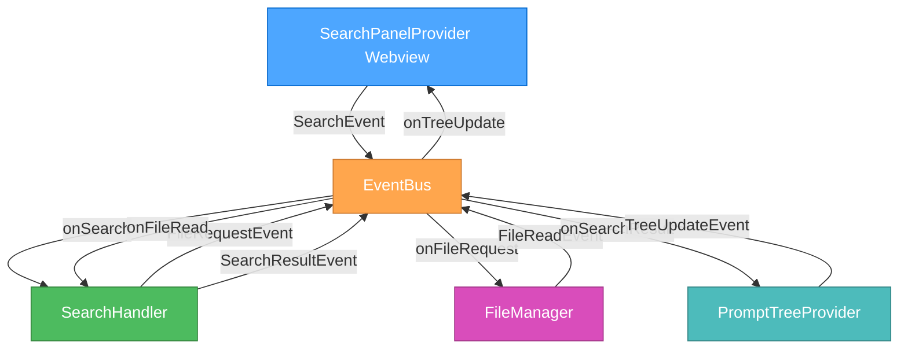
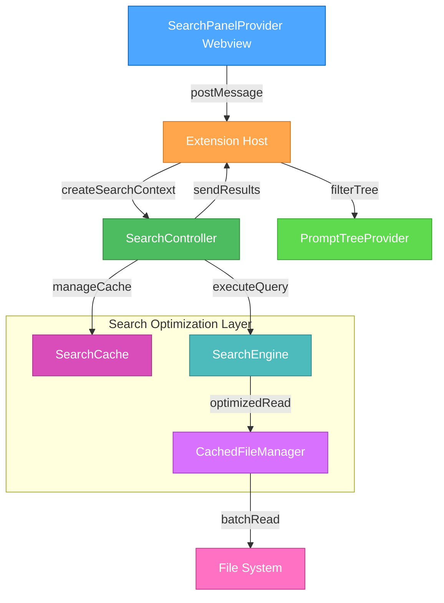
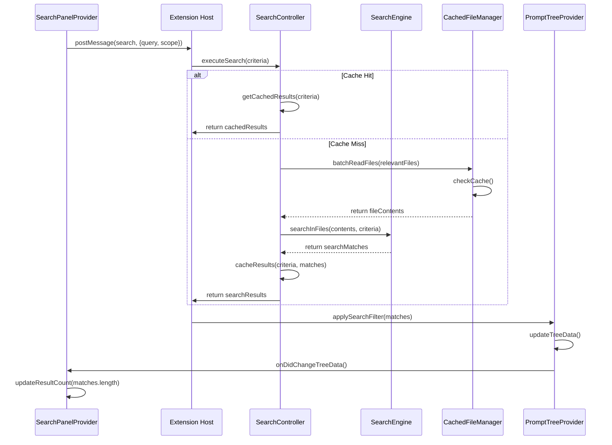
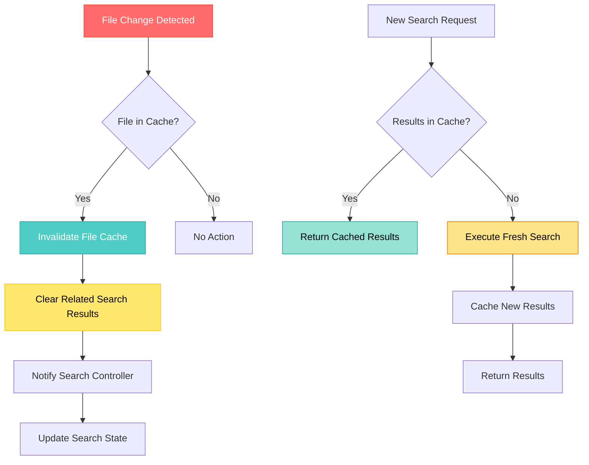

# 🎨🎨🎨 ENTERING CREATIVE PHASE: ARCHITECTURE DESIGN 🎨🎨🎨

## Component: Search System Integration Architecture

### Problem Statement

Design a robust, performant architecture for integrating real-time search functionality with the existing VSCode extension architecture. The system must efficiently handle communication between the webview search interface, tree data provider, and file system operations while maintaining responsive performance for large prompt collections (100+ files).

### Requirements & Constraints

**Functional Requirements:**

- Real-time search with 300ms debouncing
- Support for title and content search modes
- Maintain tree structure during filtering
- Handle YAML front matter parsing efficiently
- Provide search result caching for performance
- Support search state persistence during session

**Technical Constraints:**

- Must integrate with existing PromptTreeProvider
- Must use VSCode Webview message passing
- Must handle asynchronous file operations safely
- Must prevent UI blocking during search operations
- Memory efficient for large file collections
- Error handling for file system failures

**Performance Requirements:**

- Search response time < 200ms for 100 files
- Memory usage increase < 50MB for search caching
- No UI blocking during search operations
- Efficient incremental search updates

### 🎨 CREATIVE CHECKPOINT: Requirements Analysis Complete

## Multiple Architecture Options Analysis

### Option 1: Direct Communication Architecture

**Description**: Webview communicates directly with PromptTreeProvider through extension context, with inline search logic in the tree provider.

**Architecture Diagram:**



**Component Responsibilities:**

- **SearchPanelProvider**: UI rendering and user interaction
- **Extension Host**: Message routing and coordination
- **PromptTreeProvider**: Search execution and tree filtering
- **FileManager**: File content retrieval and caching

**Pros:**

- Simple architecture with clear communication path
- Minimal component dependencies
- Easy to debug and maintain
- Direct control over search timing
- Leverages existing tree provider patterns

**Cons:**

- Couples search logic tightly to tree provider
- Limited reusability of search functionality
- May bloat PromptTreeProvider with search concerns
- Difficult to add alternative search interfaces
- Performance bottleneck in single component

**Complexity**: Low
**Implementation Time**: 3-4 hours
**Maintainability**: Medium
**Scalability**: Low

### Option 2: Dedicated Search Service Architecture

**Description**: Separate SearchService handles all search operations, with clear interfaces between components and centralized search state management.

**Architecture Diagram:**



**Component Responsibilities:**

- **SearchService**: Orchestrates search operations and state management
- **SearchCache**: Efficient result caching and invalidation
- **FileSearchEngine**: Core search algorithms and content parsing
- **PromptTreeProvider**: Tree filtering and display updates only

**Pros:**

- Clear separation of concerns
- Highly reusable search functionality
- Centralized performance optimizations
- Easy to test search logic independently
- Scalable for future search features
- Better error handling isolation

**Cons:**

- More complex architecture to implement
- Additional abstraction layers
- Requires careful interface design
- More components to coordinate
- Potential for over-engineering

**Complexity**: High
**Implementation Time**: 6-8 hours
**Maintainability**: High
**Scalability**: High

### Option 3: Event-Driven Architecture

**Description**: Components communicate through event system with loose coupling, search operations handled asynchronously with event notifications.

**Architecture Diagram:**



**Component Responsibilities:**

- **EventBus**: Central event coordination and routing
- **SearchHandler**: Event-driven search processing
- **Components**: Loosely coupled through events only

**Pros:**

- Maximum component decoupling
- Easy to add new search features
- Excellent testability
- Natural async operation handling
- Future-proof architecture
- Easy to debug with event logging

**Cons:**

- Complex event flow to understand
- Potential for event ordering issues
- Debugging can be challenging
- May be overkill for current requirements
- Event subscription management complexity

**Complexity**: Very High
**Implementation Time**: 8-10 hours
**Maintainability**: High
**Scalability**: Very High

### Option 4: Hybrid Service-Provider Architecture

**Description**: Combines dedicated search service benefits with simplified communication patterns, optimized for VSCode extension context.

**Architecture Diagram:**



**Component Responsibilities:**

- **SearchController**: Lightweight search coordination
- **SearchEngine**: Core search algorithms with optimizations
- **CachedFileManager**: Intelligent file caching and batch operations

**Pros:**

- Balanced complexity and functionality
- Good performance optimizations
- Reasonable implementation effort
- Clear component boundaries
- Extensible for future needs
- VSCode extension patterns friendly

**Cons:**

- Still requires multiple new components
- Cache management complexity
- Interface design requirements
- More complex than direct approach

**Complexity**: Medium-High
**Implementation Time**: 5-6 hours
**Maintainability**: High
**Scalability**: Medium-High

## 🎨 CREATIVE CHECKPOINT: Options Generated

### Recommended Approach: Option 4 - Hybrid Service-Provider Architecture

**Selection Rationale:**

1. **Balanced Complexity**: Provides necessary separation of concerns without over-engineering
2. **Performance Focus**: Includes dedicated optimization layer for file operations
3. **VSCode Integration**: Works well with extension host communication patterns
4. **Future-Friendly**: Extensible without major architectural changes
5. **Implementation Feasible**: Reasonable development time for project scope
6. **Testability**: Clear component boundaries enable effective testing

## Detailed Architecture Design

### Core Components

#### 1. SearchController

```typescript
interface SearchController {
  // Main search coordination
  executeSearch(criteria: SearchCriteria): Promise<SearchResults>;
  clearSearch(): void;

  // State management
  getSearchState(): SearchState;
  updateSearchState(state: Partial<SearchState>): void;

  // Cache management
  invalidateCache(): void;
  preloadFiles(filePaths: string[]): Promise<void>;
}

interface SearchCriteria {
  query: string;
  scope: "titles" | "content" | "both";
  caseSensitive?: boolean;
  useRegex?: boolean;
}

interface SearchResults {
  matches: SearchMatch[];
  totalFiles: number;
  searchTime: number;
  fromCache: boolean;
}

interface SearchMatch {
  filePath: string;
  matchType: "title" | "content";
  matchPositions?: MatchPosition[];
  snippet?: string;
}
```

#### 2. SearchEngine

```typescript
interface SearchEngine {
  // Search algorithms
  searchInTitle(content: string, query: string): boolean;
  searchInContent(content: string, query: string): MatchPosition[];

  // Parsing utilities
  extractYAMLFrontMatter(content: string): { title?: string; content: string };
  createSearchSnippet(content: string, position: MatchPosition): string;

  // Performance optimizations
  buildSearchIndex(files: FileContent[]): SearchIndex;
  searchWithIndex(index: SearchIndex, query: string): SearchResults;
}
```

#### 3. CachedFileManager

```typescript
interface CachedFileManager extends FileManager {
  // Enhanced file operations
  batchReadFiles(filePaths: string[]): Promise<FileContent[]>;
  getCachedContent(filePath: string): FileContent | null;
  preloadCache(filePaths: string[]): Promise<void>;

  // Cache management
  clearCache(): void;
  getCacheStats(): CacheStats;

  // Content watching
  watchForChanges(filePaths: string[]): void;
  onFileChanged(handler: (filePath: string) => void): void;
}
```

### Communication Flow

#### Search Execution Flow



#### Cache Management Strategy



### Performance Optimizations

#### 1. Intelligent Caching Strategy

- **File Content Cache**: LRU cache with 50MB limit
- **Search Result Cache**: Query-based caching with TTL
- **Incremental Search**: Cache partial results for query expansion
- **Batch File Reading**: Reduce file system calls

#### 2. Search Algorithm Optimizations

- **Boyer-Moore Algorithm**: For efficient string searching
- **Search Index**: Pre-built index for frequently searched content
- **Parallel Processing**: Worker threads for large file collections
- **Early Termination**: Stop search when sufficient results found

#### 3. Memory Management

- **Lazy Loading**: Load file content only when needed
- **Memory Monitoring**: Track cache size and garbage collect
- **Weak References**: Prevent memory leaks in event handlers
- **Content Streaming**: Stream large files instead of loading entirely

### Error Handling Strategy

#### 1. File System Errors

```typescript
class SearchErrorHandler {
  handleFileReadError(filePath: string, error: Error): SearchMatch[] {
    console.warn(`Failed to read file ${filePath}:`, error);
    // Return empty results but don't fail entire search
    return [];
  }

  handleSearchTimeout(query: string): SearchResults {
    return {
      matches: [],
      totalFiles: 0,
      searchTime: 5000,
      fromCache: false,
      error: "Search timeout - please try a more specific query",
    };
  }
}
```

#### 2. Communication Errors

- **Message Retry Logic**: Retry failed webview messages
- **Graceful Degradation**: Provide basic search if advanced features fail
- **Error User Feedback**: Clear error messages in search UI
- **Logging**: Comprehensive error logging for debugging

### Implementation Plan

#### Phase 1: Core Architecture (2 hours)

1. Create SearchController interface and basic implementation
2. Set up webview-extension message passing
3. Implement basic search criteria handling
4. Create error handling framework

#### Phase 2: Search Engine (2 hours)

1. Implement SearchEngine with basic algorithms
2. Add YAML front matter parsing
3. Create search result formatting
4. Add basic performance optimizations

#### Phase 3: Caching Layer (1.5 hours)

1. Extend FileManager with caching capabilities
2. Implement LRU cache for file content
3. Add search result caching
4. Create cache invalidation logic

#### Phase 4: Integration & Testing (0.5 hours)

1. Integrate all components
2. Test search performance with sample data
3. Validate error handling scenarios
4. Verify memory usage patterns

## Verification Against Requirements

**✓ Real-time search with 300ms debouncing**: SearchController manages timing
**✓ Title and content search modes**: SearchEngine supports both modes
**✓ Tree structure maintenance**: PromptTreeProvider handles filtering
**✓ Efficient YAML parsing**: SearchEngine optimized parsing
**✓ Search result caching**: CachedFileManager provides intelligent caching
**✓ Session state persistence**: SearchController manages state
**✓ Webview integration**: Clear message passing architecture
**✓ Async file operations**: CachedFileManager handles async safely
**✓ UI non-blocking**: Async architecture prevents blocking
**✓ Memory efficiency**: Caching strategy with memory limits
**✓ Error handling**: Comprehensive error handling strategy

🎨🎨🎨 EXITING CREATIVE PHASE: ARCHITECTURE DESIGN COMPLETE 🎨🎨🎨
